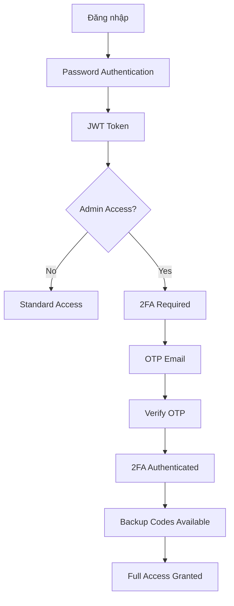

# 🔐 Hệ thống Backend với Bảo mật Cấp độ 5

[](https://nodejs.org/)
[](https://expressjs.com/)
[](https://www.mongodb.com/)
[](https://example.com)

> **Hệ thống backend Node.js với bảo mật cấp độ 5, tích hợp Face Recognition AI và xác thực đa lớp cao cấp**

## 📋 Mục lục

- [Tính năng nổi bật](#-tính-năng-nổi-bật)
- [Cài đặt và Chạy](#-cài-đặt-và-chạy)
- [Cấu trúc Project](#-cấu-trúc-project)
- [API Endpoints](#-api-endpoints)
- [Hệ thống Bảo mật](#-hệ-thống-bảo-mật)
- [Face Recognition](#-face-recognition)
- [Location Tracking](#-location-tracking)
- [Testing](#-testing)
- [Deployment](#-deployment)
- [Troubleshooting](#-troubleshooting)

## 🚀 Tính năng nổi bật

### 🔐 **Bảo mật cấp độ 5**
- **Mã hóa đặc biệt** với 7 lớp bảo vệ
- **Xác thực đa lớp** (Password → OTP → 2FA → Mã dự phòng)
- **Hệ thống khóa tài khoản** tự động
- **Tracking bảo mật** toàn diện

### 🎭 **Face Recognition AI**
- **Gần 100 thông số đặc trưng** khuôn mặt
- **68 điểm landmarks** chi tiết
- **Mã hóa cấp độ 5** với vector 128 chiều
- **So sánh khuôn mặt** với độ chính xác cao

### 📍 **Location Tracking nâng cao**
- **30+ thông số thiết bị** chi tiết
- **GPS tracking** thời gian thực
- **Phân tích rủi ro** bảo mật
- **Geolocation services** tích hợp

### 🌐 **Web Technologies**
- **Express.js** với middleware bảo mật
- **MongoDB** với Mongoose ODM
- **Socket.io** cho real-time features
- **JWT Authentication** bảo mật cao

## 🛠️ Cài đặt và Chạy

### Yêu cầu hệ thống

```bash
Node.js >= 22.15.0
MongoDB >= 7.0
npm >= 9.0.0
Git >= 2.0.0
```

### Cài đặt

```bash
# Clone repository
git clone <repository-url>
cd backend/Data

# Cài đặt dependencies
npm install

# Sao chép file môi trường
cp .env.example .env

# Chỉnh sửa thông tin database trong .env
# MONGODB_URI=mongodb://localhost:27017/your-database
# JWT_SECRET=your-super-secret-jwt-key
# PORT=3000

# Khởi tạo admin user (tùy chọn)
node seedAdmin.js

# Chạy ứng dụng ở chế độ development
npm run dev

# Chạy production
npm start
```

### Kiểm tra hoạt động

```bash
# Ứng dụng sẽ chạy tại:
# http://localhost:3000

# API Documentation:
# http://localhost:3000/api

# Face Scanner Interface:
# http://localhost:3000/client/face-scanner.html
```

## 📁 Cấu trúc Project

```
backend/Data/
├── client/                          # Frontend files
│   ├── css/                         # Stylesheets
│   ├── js/                          # JavaScript files
│   └── face-scanner.html           # Face scanner interface
├── config/                          # Configuration files
│   └── database.js                 # Database connection
├── controllers/                     # Request handlers
│   ├── authController.js           # Authentication logic
│   ├── chatController.js           # Chat system
│   ├── faceRecognitionController.js # Face recognition
│   ├── locationController.js       # Location tracking
│   └── userController.js           # User management
├── middlewares/                     # Express middlewares
│   ├── advancedSecurityAuth.js     # 2FA & OTP security
│   ├── authCheckAdmin.js           # Admin authorization
│   ├── authRateLimit.js            # Rate limiting
│   ├── authVerifyToken.js          # JWT verification
│   ├── chatSecurity.js             # Chat security
│   ├── errorHandler.js             # Error handling
│   ├── securityCors.js             # CORS configuration
│   ├── securityHelmet.js           # Security headers
│   ├── securitySanitize.js         # Input sanitization
│   └── webTracking.js              # Activity tracking
├── models/                          # Mongoose models
│   ├── EncodeFacedID.js            # Face data model
│   ├── LocationsClient.js          # Location tracking
│   ├── User.js                     # User model
│   ├── CreateNewUser.js            # Registration model
│   ├── TrackingUserForLogout.js    # Logout tracking
│   └── UserChatNew.js              # Chat user model
├── routes/                          # API routes
│   ├── chat.js                     # Chat endpoints
│   └── faceID.js                   # Face recognition endpoints
├── utils/                           # Utility functions
│   ├── auth.js                     # Authentication utilities
│   ├── faceEncryption.js           # Level 5 encryption
│   └── otpService.js               # OTP services
├── validations/                     # Input validation
│   ├── expressValidators.js        # Express validators
│   └── joiSchemas.js               # Joi schemas
├── tests/                           # Test files
│   ├── integration/                # Integration tests
│   └── unit/                       # Unit tests
├── coverage/                        # Test coverage reports
├── logs/                           # Application logs
├── public/                         # Static files
├── views/                          # EJS templates
├── .env                            # Environment variables
├── .env.example                    # Environment template
├── .env.test                       # Test environment
├── index.js                        # Main application file
├── package.json                    # Dependencies
└── TESTING_README.md              # Testing documentation
```

## 🌐 API Endpoints

### 🔐 **Authentication Endpoints**

#### Đăng nhập và Đăng ký
```http
POST /login
Content-Type: application/json

{
  "email": "admin@example.com",
  "password": "your-password"
}

POST /api/v1/signIn
Content-Type: application/json

{
  "name": "Nguyễn Văn A",
  "age": 25,
  "address": "123 Đường ABC",
  "job": "Developer",
  "phone": "0987654321",
  "email": "user@example.com",
  "password": "password123"
}
```

#### Xác thực 2FA
```http
# Gửi OTP qua email
POST /api/faceID/2fa/send-otp
Authorization: Bearer <token>

# Xác minh OTP
POST /api/faceID/2fa/verify-otp
Authorization: Bearer <token>
Content-Type: application/json

{
  "otpId": "otp-id-from-send",
  "otp": "123456"
}

# Xác minh mã dự phòng
POST /api/faceID/2fa/verify-backup-code
Authorization: Bearer <token>
Content-Type: application/json

{
  "backupCode": "ABCD1234EFGH"
}

# Tạo mã dự phòng mới
POST /api/faceID/2fa/generate-backup-codes
Authorization: Bearer <token>

# Kiểm tra trạng thái 2FA
GET /api/faceID/2fa/status
Authorization: Bearer <token>

# Đăng xuất 2FA
POST /api/faceID/2fa/logout
Authorization: Bearer <token>
```

### 🎭 **Face Recognition Endpoints** (Yêu cầu 2FA)

#### Mã hóa khuôn mặt
```http
POST /api/faceID/encode
Authorization: Bearer <token>
Content-Type: application/json

{
  "faceId": "unique-face-id",
  "faceEncoding": {
    "primary": [0.1, 0.2, 0.3, ...] // 128 giá trị đặc trưng
  },
  "facialLandmarks": {
    "leftEye": {
      "center": { "x": 200, "y": 150 },
      "contour": [...]
    },
    "rightEye": { ... },
    "nose": { ... },
    "mouth": { ... }
  },
  "facialFeatures": {
    "faceShape": "oval",
    "ratios": {
      "faceWidthToHeight": 0.8,
      "eyeDistanceToFaceWidth": 0.3
    }
  },
  "technicalSpecs": {
    "confidence": 95,
    "imageQuality": 90,
    "lighting": "good"
  },
  "securityLevel": "high"
}
```

#### Giải mã khuôn mặt
```http
POST /api/faceID/decode
Authorization: Bearer <token>
Content-Type: application/json

{
  "faceId": "unique-face-id",
  "encryptedData": "encrypted-face-data",
  "checksum": "data-checksum"
}
```

#### So sánh khuôn mặt
```http
POST /api/faceID/compare
Authorization: Bearer <token>
Content-Type: application/json

{
  "faceId1": "face-id-1",
  "faceId2": "face-id-2",
  "threshold": 0.6
}
```

#### Quản lý Face Data
```http
# Lấy danh sách face data của user
GET /api/faceID/user/:userId?page=1&limit=20
Authorization: Bearer <token>

# Lấy thông tin face data theo ID
GET /api/faceID/:faceId
Authorization: Bearer <token>

# Cập nhật face data
PUT /api/faceID/:faceId
Authorization: Bearer <token>
Content-Type: application/json

{
  "technicalSpecs": { "confidence": 98 },
  "securityLevel": "critical"
}

# Xóa face data
DELETE /api/faceID/:faceId
Authorization: Bearer <token>

# Xác minh face data
POST /api/faceID/:faceId/verify
Authorization: Bearer <token>
Content-Type: application/json

{
  "verificationMethod": "admin",
  "notes": "Verified by admin"
}
```

#### Thống kê và Bảo mật
```http
# Lấy thống kê face recognition
GET /api/faceID/stats/overview
Authorization: Bearer <token>

# Xoay vòng master key
POST /api/faceID/rotate-key
Authorization: Bearer <token>

# Lấy thông tin bảo mật hệ thống
GET /api/faceID/security/info
Authorization: Bearer <token>
```

### 📍 **Location Tracking Endpoints** (Yêu cầu 2FA)

#### Ghi nhận vị trí hiện tại
```http
POST /api/faceID/location/current
Authorization: Bearer <token>
Content-Type: application/json

{
  "latitude": 21.0285,
  "longitude": 105.8542,
  "accuracy": 10,
  "country": "Vietnam",
  "city": "Hanoi",
  "deviceInfo": {
    "platform": "Windows",
    "browser": "Chrome",
    "os": "Windows 11"
  }
}
```

#### Lịch sử vị trí
```http
GET /api/faceID/location/history/:userId?page=1&limit=50&startDate=2024-01-01
Authorization: Bearer <token>
```

#### Vị trí đáng ngờ
```http
GET /api/faceID/location/suspicious?limit=100&minRiskScore=70
Authorization: Bearer <token>
```

#### Thống kê vị trí theo quốc gia
```http
GET /api/faceID/location/stats/countries?startDate=2024-01-01&endDate=2024-12-31
Authorization: Bearer <token>
```

### 💬 **Chat Endpoints** (Có bảo mật)

#### Đăng ký chat
```http
POST /chat/register
Authorization: Bearer <token>
Content-Type: application/json

{
  "username": "user123",
  "displayName": "Nguyễn Văn A"
}
```

#### Gửi tin nhắn private
```http
POST /chat/messages/private
Authorization: Bearer <token>
Content-Type: application/json

{
  "recipientId": "user-id",
  "message": "Hello!",
  "messageType": "text"
}
```

#### Gửi tin nhắn nhóm
```http
POST /chat/messages/group
Authorization: Bearer <token>
Content-Type: application/json

{
  "groupId": "group-id",
  "message": "Hello group!",
  "messageType": "text"
}
```

### 👥 **User Management Endpoints**

#### CRUD Users
```http
# Lấy tất cả users
GET /api/v1/user
Authorization: Bearer <token>

# Tạo user mới
POST /api/v1/user
Authorization: Bearer <token>
Content-Type: application/json

{
  "name": "Nguyễn Văn B",
  "age": 30,
  "address": "456 Đường XYZ",
  "email": "newuser@example.com",
  "role": "user"
}

# Lấy thông tin user theo ID
GET /api/v1/user/:id
Authorization: Bearer <token>

# Cập nhật user
PUT /api/v1/user/:id
Authorization: Bearer <token>
Content-Type: application/json

{
  "name": "Updated Name",
  "age": 31
}

# Xóa user
DELETE /api/v1/user/:id
Authorization: Bearer <token>
```

### 📊 **Tracking Endpoints**

#### GPS Location Tracking
```http
POST /api/track-location
Authorization: Bearer <token>
Content-Type: application/json

{
  "latitude": 21.0285,
  "longitude": 105.8542,
  "accuracy": 5
}
```

#### Device Information Tracking
```http
POST /api/track-device-info
Authorization: Bearer <token>
Content-Type: application/json

{
  "userAgent": "Mozilla/5.0...",
  "platform": "Windows",
  "browser": "Chrome",
  "screenResolution": "1920x1080"
}
```

#### Session Tracking
```http
POST /api/track-session
Authorization: Bearer <token>
Content-Type: application/json

{
  "sessionId": "session-id",
  "startTime": "2024-01-01T00:00:00Z",
  "userAgent": "Mozilla/5.0..."
}
```

#### Thống kê Tracking (Admin only)
```http
GET /api/tracking/stats
Authorization: Bearer <token>

GET /api/tracking/export
Authorization: Bearer <token>
```

## 🛡️ Hệ thống Bảo mật

### Cấp độ Bảo mật

#### **Level 1: Basic Authentication**
- JWT token validation
- Session management
- Rate limiting cơ bản

#### **Level 2: Input Validation**
- Express validators
- Joi schema validation
- SQL injection prevention
- XSS protection

#### **Level 3: Advanced Security**
- CORS configuration
- Security headers (Helmet)
- Input sanitization
- CSRF protection

#### **Level 4: Activity Monitoring**
- Comprehensive logging
- Audit trails
- Suspicious activity detection
- Real-time monitoring

#### **Level 5: Advanced Encryption** ⭐
- **7 lớp mã hóa đặc biệt**
- **Vector encryption 128 chiều**
- **Quantum simulation encryption**
- **Neural network encryption**
- **Multi-layer key rotation**

### Xác thực đa lớp



### Mã hóa đặc biệt

#### Face Data Encryption
```javascript
// Mã hóa với cấp độ 5
const encryptedData = await encryptFaceData(faceData, userId, sessionId);

// Giải mã với xác thực
const decryptedData = await decryptFaceData(encryptedData, userId, sessionId);

// So sánh khuôn mặt bảo mật
const comparison = await compareFaces(face1, face2, userId1, userId2, sessionId);
```

## 🎭 Face Recognition

### Thông số đặc trưng khuôn mặt

#### **68 Facial Landmarks**
- **Mắt**: 16 điểm (8 điểm mỗi mắt)
- **Lông mày**: 10 điểm mỗi bên
- **Mũi**: 9 điểm
- **Miệng**: 20 điểm
- **Cằm**: 17 điểm đường viền

#### **32 Thông số đặc trưng**
- **Hình học**: Diện tích, chu vi, độ compact
- **Đối xứng**: Trái-phải, trên-dưới
- **Tỷ lệ**: Mặt rộng/cao, khoảng cách mắt
- **Màu sắc**: Tone da, texture, nếp nhăn

### Cách sử dụng Face Recognition

#### 1. Mã hóa khuôn mặt
```javascript
// Chuẩn bị dữ liệu khuôn mặt
const faceData = {
  faceId: "unique-id",
  faceEncoding: {
    primary: [0.1, 0.2, 0.3, ...] // 128 giá trị
  },
  facialLandmarks: { /* 68 điểm chi tiết */ },
  facialFeatures: { /* 32 thông số */ },
  technicalSpecs: {
    confidence: 95,
    imageQuality: 90
  }
};

// Gửi đến API để mã hóa
const response = await fetch('/api/faceID/encode', {
  method: 'POST',
  headers: {
    'Authorization': `Bearer ${token}`,
    'Content-Type': 'application/json'
  },
  body: JSON.stringify(faceData)
});
```

#### 2. So sánh khuôn mặt
```javascript
const comparison = await fetch('/api/faceID/compare', {
  method: 'POST',
  headers: {
    'Authorization': `Bearer ${token}`,
    'Content-Type': 'application/json'
  },
  body: JSON.stringify({
    faceId1: "face-id-1",
    faceId2: "face-id-2",
    threshold: 0.6
  })
});

const result = await comparison.json();
console.log(`Similarity: ${result.data.comparison.confidence}%`);
```

## 📍 Location Tracking

### Thông tin thiết bị được tracking

#### **Hardware Information**
- Device memory, CPU cores
- Screen resolution, pixel ratio
- Touch support, camera, microphone

#### **Network Information**
- Connection type (WiFi, 4G, Ethernet)
- ISP, organization, ASN
- Connection speed, latency

#### **Security Information**
- VPN detection, proxy detection
- Risk score calculation
- Suspicious activity flags

#### **Geolocation Data**
- GPS coordinates (latitude, longitude)
- Accuracy, altitude, heading
- Country, city, region information

### Cách sử dụng Location Tracking

```javascript
// Gửi vị trí hiện tại
const locationData = {
  latitude: 21.0285,
  longitude: 105.8542,
  accuracy: 10,
  deviceInfo: {
    platform: "Windows",
    browser: "Chrome",
    screenResolution: "1920x1080"
  }
};

await fetch('/api/faceID/location/current', {
  method: 'POST',
  headers: {
    'Authorization': `Bearer ${token}`,
    'Content-Type': 'application/json'
  },
  body: JSON.stringify(locationData)
});
```

## 🧪 Testing

### Chạy tất cả tests

```bash
# Chạy unit tests
npm test

# Chạy tests với coverage
npm run test:coverage

# Chạy integration tests
npm run test:integration

# Chạy tests với watch mode
npm run test:watch
```

### Test Coverage

Ứng dụng có **test coverage toàn diện** với:
- **Unit Tests**: Controllers, Models, Utils
- **Integration Tests**: API endpoints
- **Security Tests**: Authentication, Authorization
- **Performance Tests**: Load testing

### Manual Testing

#### Test Face Recognition
1. Truy cập: `http://localhost:3000/client/face-scanner.html`
2. Đăng nhập với tài khoản admin
3. Xác thực 2FA qua email
4. Cho phép truy cập camera
5. Quét khuôn mặt và mã hóa

#### Test Location Tracking
```bash
curl -X POST http://localhost:3000/api/faceID/location/current \
  -H "Authorization: Bearer <token>" \
  -H "Content-Type: application/json" \
  -d '{
    "latitude": 21.0285,
    "longitude": 105.8542,
    "accuracy": 10
  }'
```

## 🚀 Deployment

### Production Deployment

```bash
# Build cho production
npm run build

# Chạy production server
npm start

# Với PM2
pm2 start index.js --name "backend-security"

# Với Docker
docker build -t backend-security .
docker run -p 3000:3000 backend-security
```

### Environment Variables

```env
# Database
MONGODB_URI=mongodb://localhost:27017/production-db
MONGODB_TEST_URI=mongodb://localhost:27017/test-db

# JWT
JWT_SECRET=your-super-secret-jwt-key-min-256-bits
JWT_EXPIRES_IN=24h

# Server
PORT=3000
NODE_ENV=production

# Email (cho OTP)
EMAIL_HOST=smtp.gmail.com
EMAIL_PORT=587
EMAIL_USER=your-email@gmail.com
EMAIL_PASS=your-app-password

# Security
ENCRYPTION_LEVEL=5
OTP_EXPIRY=900000
BACKUP_CODE_EXPIRY=900000

# Rate Limiting
RATE_LIMIT_WINDOW=15min
RATE_LIMIT_MAX_REQUESTS=100
```

### Monitoring và Logging

```bash
# Xem logs thời gian thực
npm run logs

# Xem metrics
npm run metrics

# Health check
curl http://localhost:3000/health

# Database backup
npm run db:backup
```

## 🔧 Troubleshooting

### Các lỗi thường gặp

#### **Lỗi EADDRINUSE (Port đã được sử dụng)**
```bash
# Tìm process sử dụng port 3000
netstat -ano | findstr :3000

# Kill process
npx kill-port 3000

# Hoặc thay đổi port trong .env
PORT=3001
```

#### **Lỗi MongoDB Connection**
```bash
# Kiểm tra MongoDB đang chạy
sudo systemctl status mongod

# Khởi động MongoDB
sudo systemctl start mongod

# Kiểm tra kết nối
mongo --eval "db.runCommand('ismaster')"
```

#### **Lỗi OTP Email**
```bash
# Kiểm tra cấu hình email trong .env
EMAIL_HOST=smtp.gmail.com
EMAIL_PORT=587
EMAIL_USER=your-email@gmail.com
EMAIL_PASS=your-app-password

# Test gửi email
npm run test:email
```

#### **Lỗi Face Recognition**
```bash
# Kiểm tra camera permissions
# Đảm bảo HTTPS cho camera access

# Test face detection
npm run test:face-detection

# Kiểm tra encryption keys
npm run test:encryption
```

### Debug Mode

```bash
# Chạy với debug logging
DEBUG=* npm run dev

# Chạy với inspect mode
npm run inspect

# Profile performance
npm run profile
```

### Performance Optimization

```bash
# Cache optimization
npm run optimize:cache

# Database indexing
npm run optimize:db

# Memory usage
npm run optimize:memory
```

## 📞 Liên hệ và Support

- **Email**: support@your-project.com
- **Documentation**: [Wiki](https://wiki.your-project.com)
- **Issues**: [GitHub Issues](https://github.com/your-repo/issues)
- **Discussions**: [GitHub Discussions](https://github.com/your-repo/discussions)

## 📄 License

MIT License - xem file [LICENSE](LICENSE) để biết thêm chi tiết.

## 🙏 Acknowledgments

- **Express.js** - Web framework
- **MongoDB** - Database
- **Mongoose** - ODM
- **JWT** - Authentication
- **Socket.io** - Real-time communication
- **Face Recognition Libraries** - AI/ML capabilities

---

**🎊 Chúc bạn sử dụng hệ thống thành công! 🎊**

*Hệ thống được xây dựng với ❤️ bởi đội ngũ phát triển chuyên nghiệp*