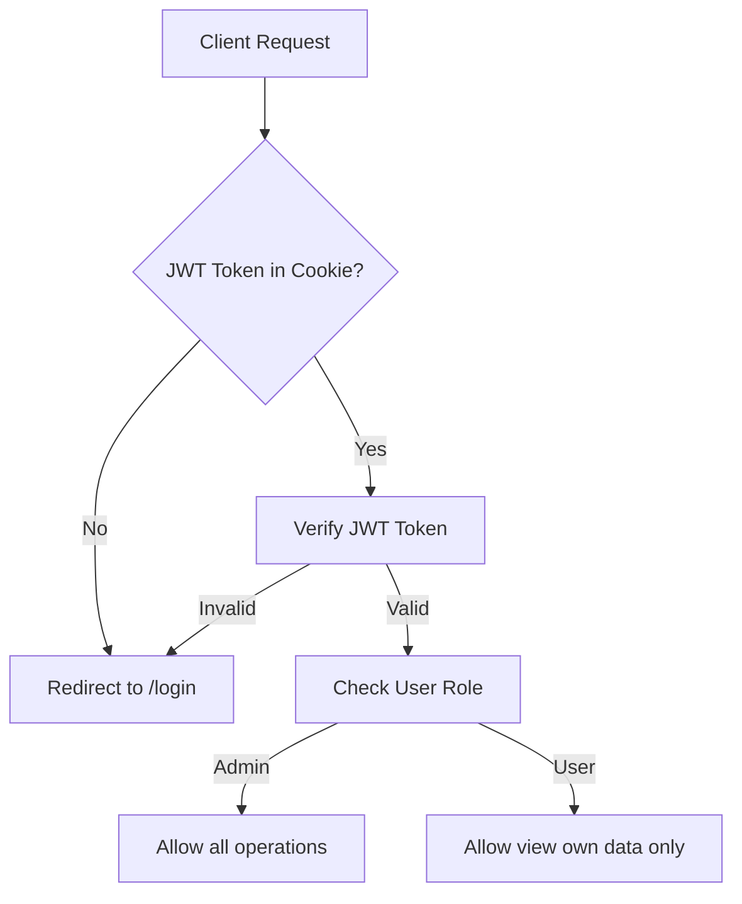
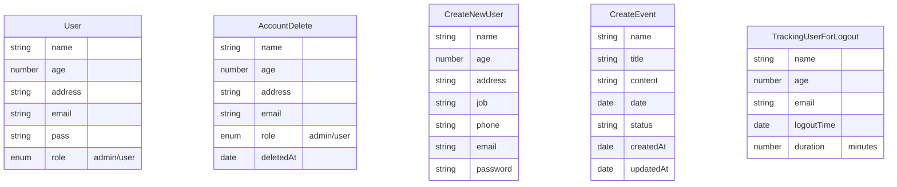
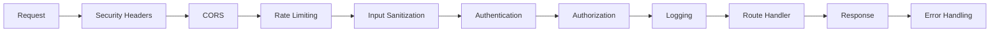

# Sơ đồ Kiến trúc Dự án Backend Node.js với Express & MongoDB

## Tổng quan Dự án

Dự án backend Node.js với SSR (Server-Side Rendering) sử dụng EJS, Express, MongoDB. Hỗ trợ authentication với JWT (lưu cookie), phân quyền role-based (admin/user), và giao diện web đẹp với animations.

## Cấu trúc Thư mục

```
backend/
├── config/
│   └── database.js              # Kết nối MongoDB
├── models/
│   ├── User.js                  # Model User (name, age, address, email, pass, role)
│   ├── AccountDelete.js         # Model lưu dữ liệu user đã xóa
│   ├── CreateNewUser.js         # Model cho đăng ký mới (name, age, address, job, phone, email, pass)
│   ├── CreateEvent.js           # Model Event (name, title, content, date, status)
│   └── TrackingUserForLogout.js # Model tracking logout (name, age, email, logoutTime, duration)
├── controllers/
│   ├── authController.js        # Controller authentication (login)
│   ├── userController.js        # Controller quản lý user (CRUD)
│   ├── dashboardController.js   # Controller dashboard (get all users ẩn sensitive data)
│   └── eventController.js       # Controller event (ACRUDS)
├── routes/
│   ├── login.js                 # Router /login (SSR EJS)
│   ├── user.js                  # Router /api/v1/user (SSR EJS)
│   ├── dashboard.js             # Router /dashboard (SSR EJS)
│   ├── signIn.js                # Router /api/v1/signIn (POST)
│   └── event.js                 # Router /event (ACRUDS SSR EJS)
├── middlewares/
│   ├── authVerifyToken.js       # Xác thực JWT token
│   ├── authCheckAdmin.js        # Kiểm tra quyền admin
│   ├── authCheckUser.js         # Kiểm tra quyền user
│   ├── authValidateSession.js   # Validate session
│   ├── authRateLimit.js         # Rate limiting cho auth
│   ├── authLogActivity.js       # Log hoạt động auth
│   ├── securityHelmet.js        # Helmet security headers
│   ├── securityCors.js          # CORS configuration
│   ├── securityCsrf.js          # CSRF protection
│   ├── securitySanitize.js      # Sanitize input
│   ├── securityRateLimit.js     # General rate limiting
│   ├── loggingRequest.js        # Log requests
│   ├── loggingError.js          # Log errors
│   ├── loggingActivity.js       # Log user activities
│   ├── loggingPerformance.js    # Performance logging
│   ├── loggingAudit.js          # Audit logging
│   ├── errorHandler.js          # Error handling
│   ├── errorLogger.js           # Error logging
│   ├── errorValidation.js       # Validation error handling
│   ├── errorAsync.js            # Async error handling
│   ├── errorNotFound.js         # 404 error handling
│   └── errorGlobal.js           # Global error handling
├── validations/
│   ├── joiSchemas.js            # Joi validation schemas cho tất cả models
│   └── expressValidators.js     # Express-validator rules
├── views/
│   ├── layout.ejs               # Layout chính
│   ├── login.ejs                # Trang login
│   ├── dashboard.ejs            # Trang dashboard
│   ├── users.ejs                # Danh sách users
│   ├── userDetail.ejs           # Chi tiết user
│   ├── createUser.ejs           # Tạo user mới
│   ├── editUser.ejs             # Chỉnh sửa user
│   ├── events.ejs               # Danh sách events
│   ├── eventDetail.ejs          # Chi tiết event
│   ├── createEvent.ejs          # Tạo event mới
│   └── editEvent.ejs            # Chỉnh sửa event
├── public/
│   ├── css/
│   │   ├── styles.css           # CSS chính
│   │   └── animations.css       # CSS animations đẹp
│   ├── js/
│   │   ├── app.js               # JavaScript chính
│   │   └── animations.js        # JavaScript animations
│   └── images/                  # Static images
├── utils/
│   └── auth.js                  # Utilities cho auth (hash password, JWT)
├── seedAdmin.js                 # Script tạo admin mặc định
├── index.js                     # File entry point
├── package.json                 # Dependencies & scripts
└── .env.example                 # Environment variables template
```

## Sơ đồ Luồng Authentication



## Sơ đồ Database Models



## API Endpoints

### Authentication
- `GET /login` - Hiển thị trang login (EJS)
- `POST /login` - Xử lý login, trả JWT token lưu cookie

### User Management (/api/v1/user)
- `GET /api/v1/user` - Lấy tất cả users (admin) / chỉ user hiện tại (user)
- `GET /api/v1/user/:id` - Lấy user theo ID
- `POST /api/v1/user` - Tạo user mới (admin only)
- `PUT /api/v1/user/:id` - Cập nhật user (admin / own data)
- `DELETE /api/v1/user/:id` - Xóa user (admin only, lưu AccountDelete)

### Dashboard
- `GET /dashboard` - Hiển thị tất cả users (ẩn email/pass)

### Sign In
- `POST /api/v1/signIn` - Đăng ký user mới (CreateNewUser model)

### Events (/event)
- `GET /event` - Danh sách events
- `GET /event/:id` - Chi tiết event
- `POST /event` - Tạo event mới
- `PUT /event/:id` - Cập nhật event
- `DELETE /event/:id` - Xóa event
- `GET /event/search?q=` - Tìm kiếm events

## Middleware Pipeline



## Security Features

- JWT Authentication với cookie storage
- Role-based Authorization (admin/user)
- Rate Limiting
- Input Validation & Sanitization
- CSRF Protection
- Security Headers (Helmet)
- CORS Configuration
- Comprehensive Logging & Audit Trail
- Logout Tracking

## Technologies Used

- **Backend**: Node.js, Express.js
- **Database**: MongoDB với Mongoose ODM
- **Authentication**: JWT, bcrypt
- **Validation**: Joi, express-validator
- **Security**: Helmet, CORS, CSRF
- **SSR**: EJS với express-ejs-layouts
- **Frontend**: HTML, CSS, JavaScript với animations
- **Utilities**: moment.js, nanoid, http-status

## Deployment Ready

- Environment configuration (.env)
- Admin seeding script
- Error handling & logging
- Performance monitoring
- Security hardened
- Scalable architecture